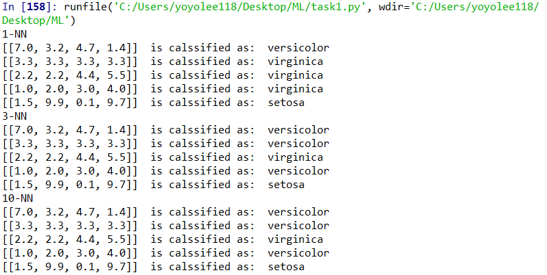
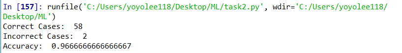

# Computing assignment 1 Report
#### 106062328 李思佑

## Code design
### 1. functions
- task1 use Myclassifier: to implement KNN classifier
- Myclassifier have 5 parameters, because labels and data are seperated in iris dataset of Sklearn

- task2 use Myclassifier and Mypredictor: Except from deciding labels, output the correction rate
- The input of Mypredictor is almost the same as Myclassifier

### 2. Data Structures and Algorithms
- for task1
- mainly use numpy
- use numpy.array to  define structured array 'distance'
- use numpy.sort to sort the structured array and make nearest neighbors accessible
- following is the sorted structured array

- then, pick up k nearest points
- finally, choose the most frequent label in the list of nearest points, using numpy.bincount, numpy.argmax
-
- for task2
- just compare the result of Myclassifier and the actual labels of testing data, sum up the cases of success and failures

### 3. Others
- importing the whole module was abandoned since the inevitable execution of task1 when executing task2.

### 4. More details are in the comments of codes

## Testing & Output
### task1
- There are  3 groups(1-NN, 3-NN, 10-NN) 
- Each with 5 pieces of data
- The first is the same as a training example in class: versicolor, so it is not misclassified
- The other four data are randomly generated, we can see that the second/fourth data is classified differently with different value of k

 
### task2
 
