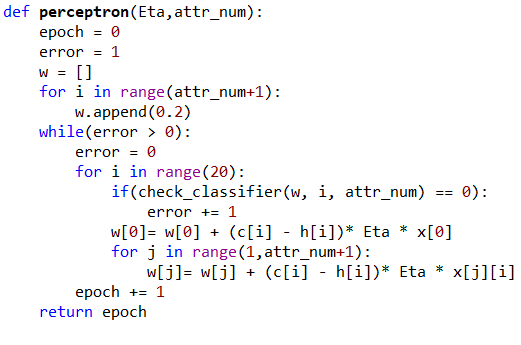
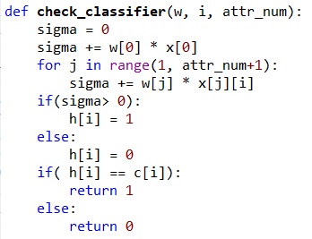
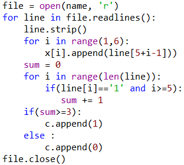
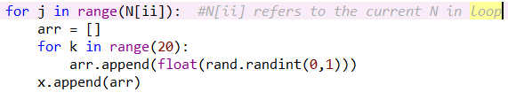
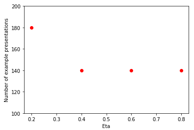
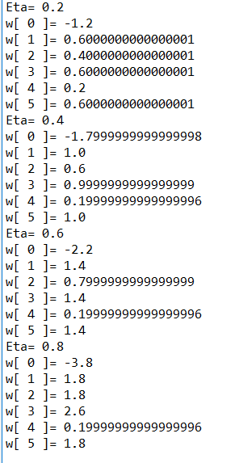
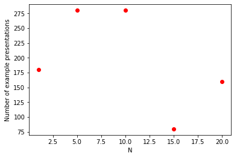
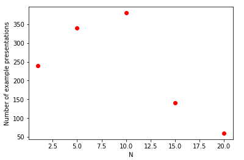
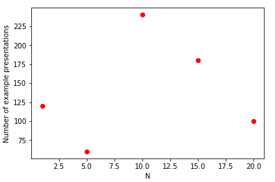
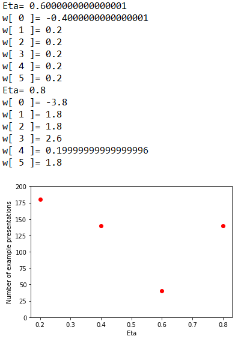

# Computing assignment 2 Report
#### 106062328 李思佑

## Code design
### 1. Functions
- perceptron
- the main body of the code
- if the newly generated weights make error predictions, stay in the everlasting loop, until the the new set of weights predict the whole set with no error. When training each example, generate the new weights thus new classifiers prepared for next training example. Finally return the number of epochs.
- parameter Eta is variable(learning rate) in task 1 
  parameter attr_num is variable N+5(added+original attributes) in task 2
  

  

- check_classifier
- use the current classifier(weights) to predict the next given training data
- compare c[i] with h[i], return wether they are the same or not
  

  

### 2. Data Structures, Read files
- weights are defined in function perceptron
- h[] is a list, being refreshed in every time checking classifier
- x[] is a 2-dimensional array, representing attribute list, appending it when reading file 

- in task 2, x[] is further appended with N random arrays that contain ith attributes of every training examples

- c[] is a list of labels for each example, append it only when reading files

## Output
### task1
- 
  
- 
### task2
Since the newly added attributes are random, there can be random results, here I present 3 different ones.(The number  of example prensentations is a multiple of 20)
- 
  
- 
  
- 

## Others
- Use pyplot to draw pictures
- There exist floating point problems that affect results, for example, in task1,  if i iteratively add up the Eta value +=0.2, the final results will appear differently
- 
 
