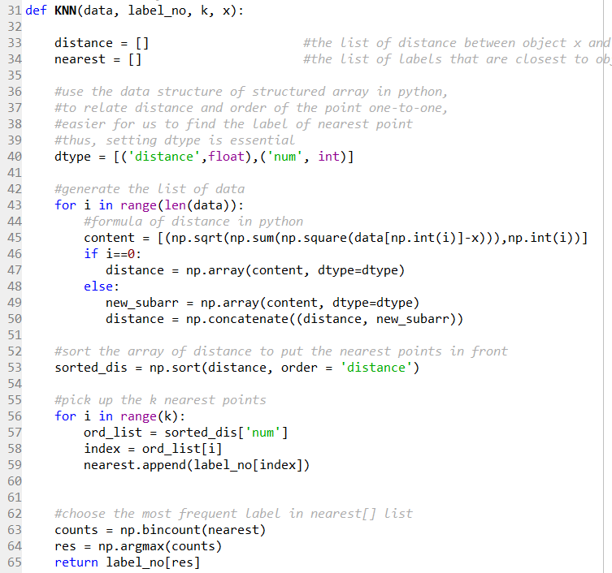
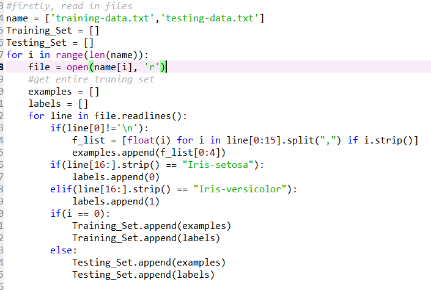
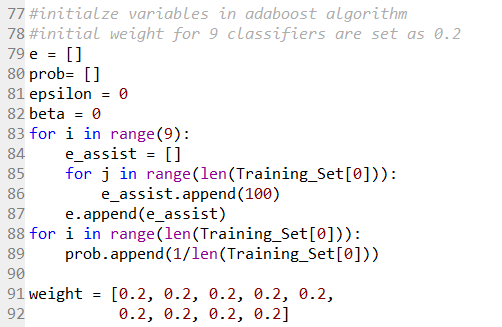
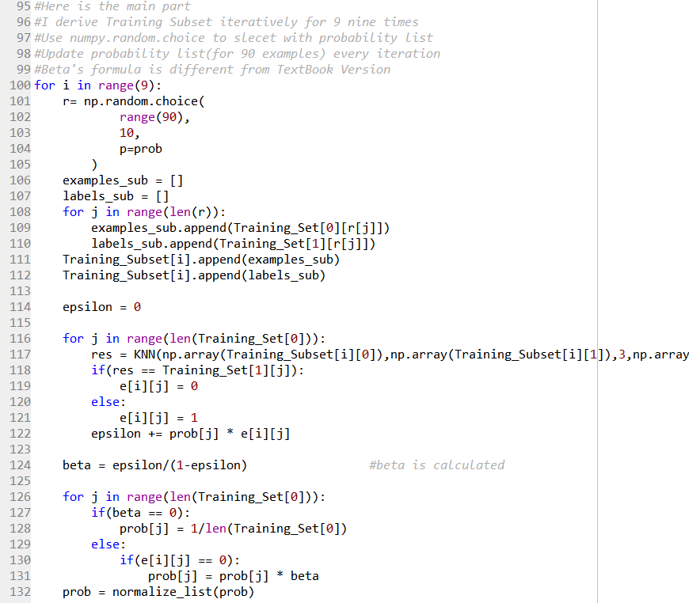
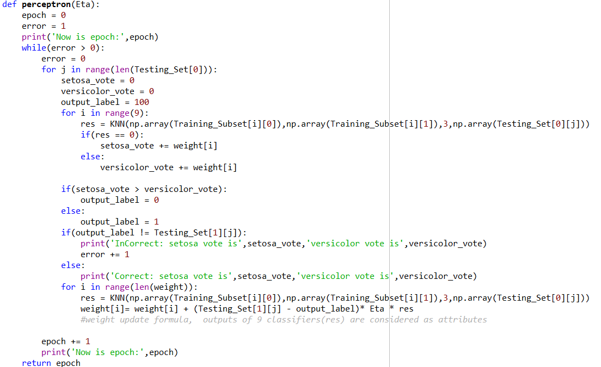
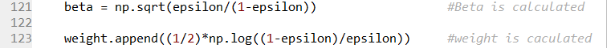
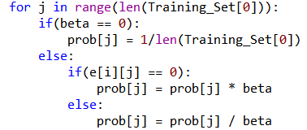
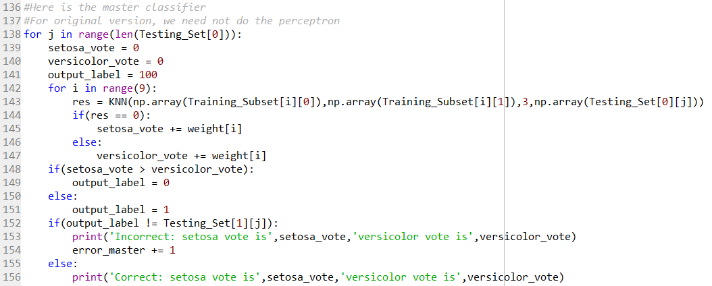
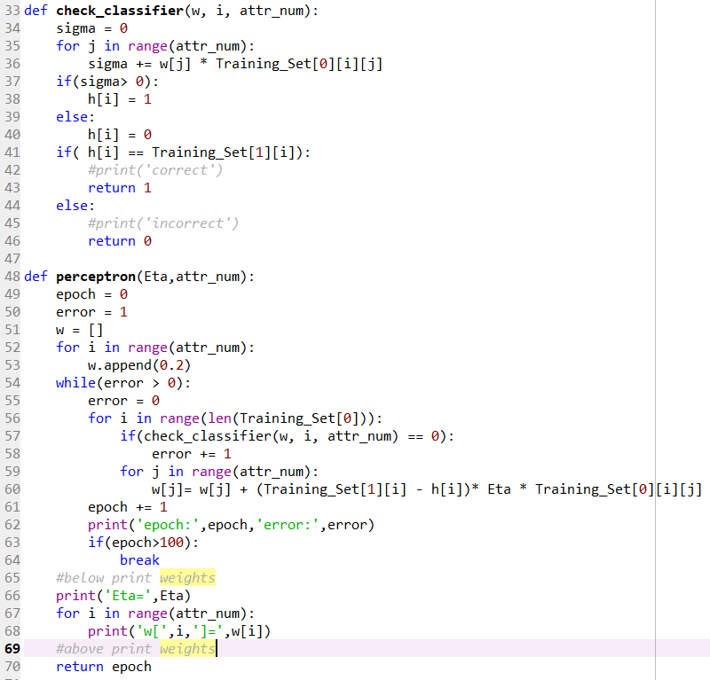

# Hw4 Computer Assignment Report
#### 106062328 李思佑

## 1. Code design
- Three python files for three different implementations
### 1. Inheritance
- Modify perceptron() in hw3, into 2 diffenrent versions
- Utilize KNN() in hw2
  

  

### 2. AdaBoost_TextBook
- readfile 
  examples and labels are seperately combined, and cocatenated into a whole structure--Training_Set/Testing_Set
  

  
- set up variables initialize weights to 0.2 as homework spec
  

  
- main part follow the psedu code of hangouts ch9 page25
 create subset -> use subset to train -> modify prob ->...(circular)
  

  
- master classifier  a specified perceptron algorithm for the master classifier, taking outputs of subclassifiers as attributes.
  

  

### 3. AdaBoost_Original
- readfile is the same as textbook version
- setting up variables are similar to textbook version, despite the weights leaving uninitialized
- main similar to textbook version, except the beta is updated differently, weight is updated. 
probability is modified for both correctly classified or misclassified examples.
 
- 
  
- 
  
- master classifier  no perceptron, meaning the cost is very low -- only 1 + 9 example presentation 
  

  

### 4. Direct_Perceptron
- perceptron is a simplified version that directly take the attributes of original training set.
  

  

### 5. More details are in the comments of code
 

## 2. Output
- Compare the three alogrithms and resuls
### AdaBoost_TextBook
- The perceptron is different from our original one in hw3. There is only one example with 9 different attributes in each epoch. 
- In the following picture, we can see that the final weight is modified slightly, since the perceptron algorithm change data by difference between examples, but our orignial dataset is too clustered.
-  
- The result of correction rate is 0.5/0.9, depending on the initial selection of data when subsampling. Since every selection the data is put back, if one class is chosen repeatedly, the master classifier could probabliy only classify one class correctly. 

### AdaBoost_Original
- From the output final weights, we can see that they are modified more carefully by this algorithm.
- Sometimes about 1/20 testcases I met it will output error rate, but we just dismiss this one
- 
- It does not need perceptron, so it saves time
  

### Direct_Perceptron
- In my implementation, the results comming out cannot converge, so I set the terminating result to epoch = 100
- The error rate is always 0.5, meaning that it can only correctly classify half of the testing data(all are classified as setosa/versicolor)
- 
- This is because the data is not irregular, data of same class are in a cluster
- 
- when consecutive examples of a same class presented , the weight can hardly be modified, so every 45 examples can the weight be modified one time.
- One better solution is to hash the data into random order.

### Conclusion
- AdaBoost outperform totally in correction rate
- Comparing 2 types of AdaBoost, the Original version is simpler, and guarantee better correction rate.
- However, if we try to modify original data into disordered set(setosa, versicolor,setosa,versicolor.....), this might be improved

 
